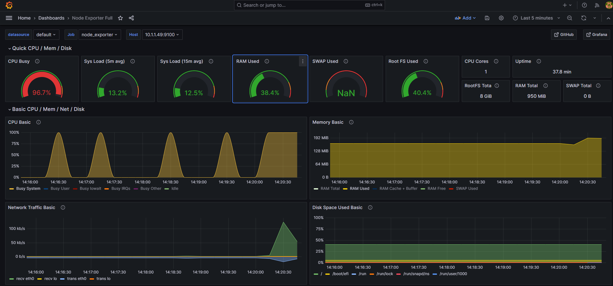
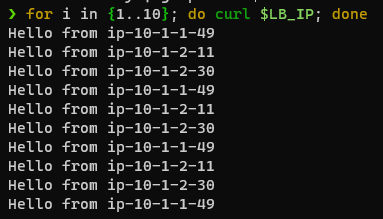

# Pipline for Infrastructure & Configuration Management
With Terraform, Ansible, Prometheus, Grafana, Nginx & NodeJS

When configured correctly this pipeline launches with two following commands

```bash
tf apply --autoapprove
ansible-playbook -i hosts.ini ./playbooks/playbook.yml --vault-id yourvaulttag@devpass
```
- an **AWS Infrastructre**
- a **[load balancer](https://www.nginx.com/resources/glossary/load-balancing/)** that:
    - distributes incoming http traffic evenly to the webservers
    - offers Monitoring and Visualisation of the webservers and itself
- x **webservers**, serving a static website with the hosts local/private ip address.


---

## Configuration
All scripts are run from a *linux-shell*

### Terraform
#### Requirements

- Set Up [SSO for AWS CLI](https://docs.aws.amazon.com/cli/latest/userguide/sso-configure-profile-token.html#sso-configure-profile-token-auto-sso) & sign in to your AWS account with `aws sso login --profile yourprofile`
- Create/Choose a ssh-keypair & register it in AWS

```bash
ssh-keygen -t rsa -b 4096 -f /path_to_folder/yourkeypairname
aws ec2 import-key-pair --profile PROFILE --key-name KEYNAME --public-key-material fileb://path_to_folder/yourkeypairname.pub
```

#### Variables
- fill out [Variables Configuration](./terraform//dev_vars.auto.tfvars) 

#### SetUp Terraform
- run:

```bash
alias tf='terraform"

tf init
tf plan --out tfplan.out
```

No Bugs to fix? Please let me know if it works for you & *why not* :smile:


### Ansible
#### Requirements
- SSH-Key-Pair registered in AWS
- Path to the private Key

#### Variables
- ssh-key & root paths in [All Hosts](./ansible//group_vars/all/main.yml)
- aws-parameters in [Load Balancer Host](./ansible/host_vars/main-example.yml) & **safe as main.yml**

#### Ansible Vault
- fill in [devpass](./ansible//devpass) with your password & set permissions to `sudo chmod 400 devpass`
- create a vault file of the aws-parameter-file

```bash
cd /path_to_project/ansible

ansible-vault encrypt host_vars/loadbalancer/main.yml --vault-id YOURNAMEorTAG@devpass
```

---
## Deployment

```bash
# Change into root directory of the project
cd /path_to_project/


# If the plan went through without errors, you can deploy infrastructure with:
tf apply terraform/tfplan.out

# Then Ansible Configuration
ansible-playbook -i ansible/hosts.ini ansible/playbooks/playbook.yml --vault-id YOURNAMEorTAG@ansible/devpass
```

## Testing

    ```bash
    # Change into root directory of the project
    cd /path_to_project/

    # Set IP of Load Balancer
    export LB_IP=$(cat terraform/datapass/ip_0)

    # Check load-balancing
    # make 10 http-requests to the load-balancer to check the feedback with the private IPs of Webservers
    for i in {1..10}; do curl $LB_IP; done 
    ```


---
## Monitoring
- Use a browser to visit [Grafana @ Load-Balancer](./terraform/datapass/ip_0) of the load-balancer on port 3000
- Set Up Grafana with the following credentials:
    - username: admin
    - password: admin

- Set Up the Prometheus and Alarmmanager Sources:
    - prometheus: 
        - url: http://localhost:9090
    - alarmmanager: 
        - type: alarmmanager
        - url: http://localhost:9093

- Add or Import a Dashboard:
    - via ID: 1860